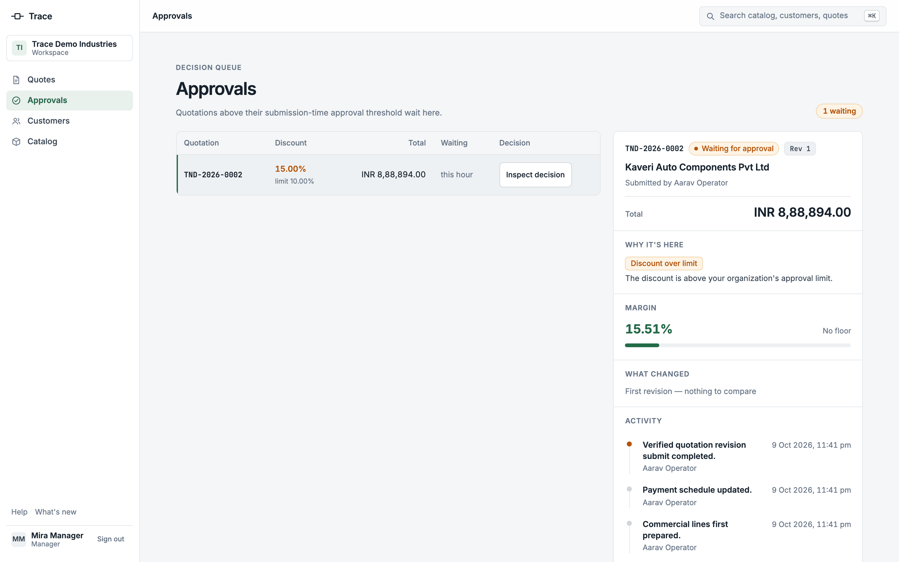
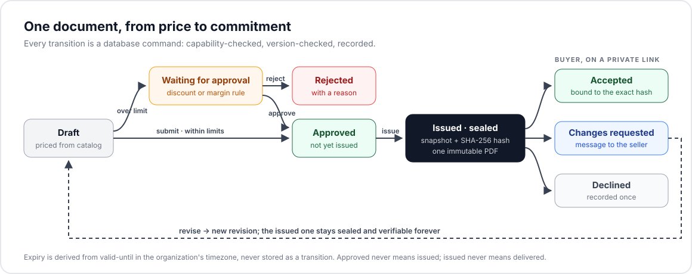
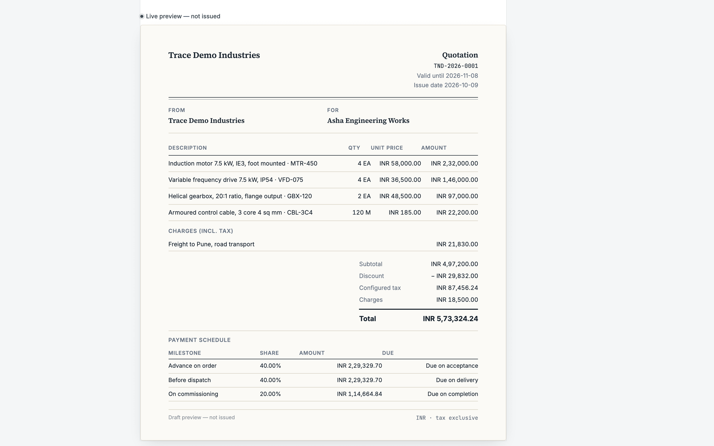
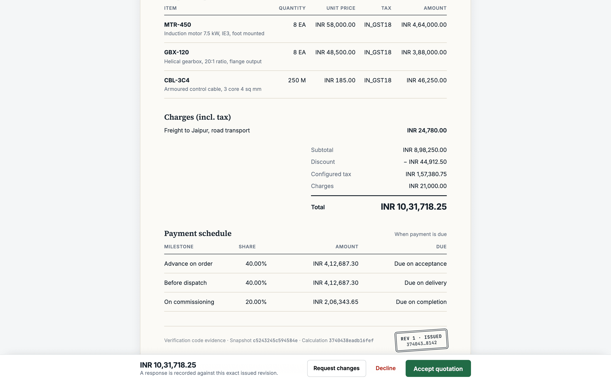
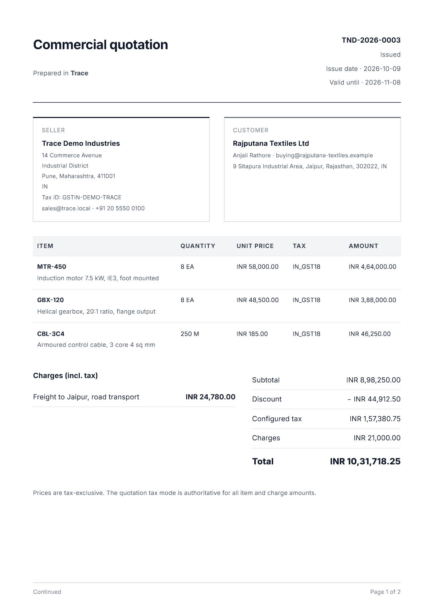
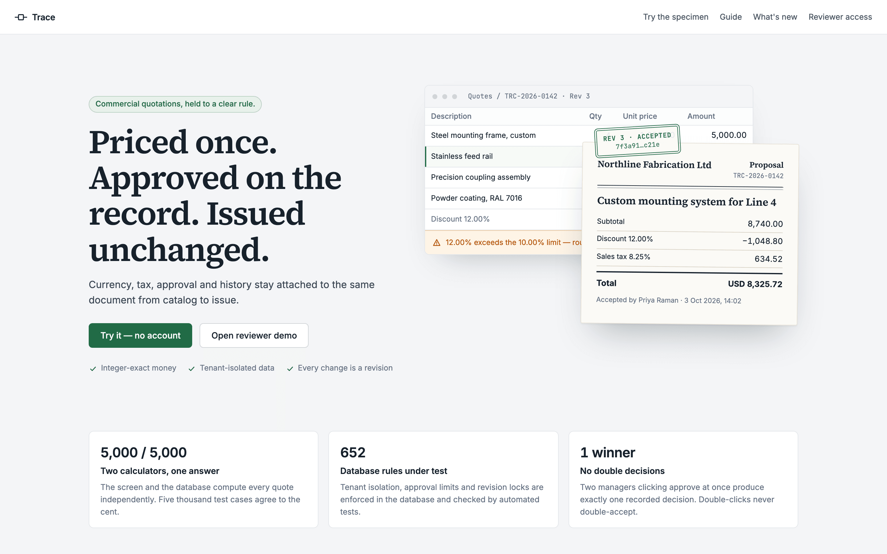
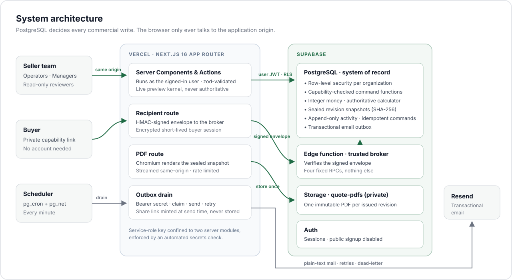

# Trace

### Commercial quotations, held to a clear rule.

**Priced once. Approved on the record. Issued unchanged.**

[**Open the live product →**](https://tender-eta-orpin.vercel.app)

 

 

## Why Trace exists

A B2B quotation is not a document. It is a **commercial commitment**: a price, a discount someone was allowed to give, terms someone approved, and a buyer who said yes to *exactly that version*.

Most quoting tools treat it like a spreadsheet with a PDF button. Numbers drift between screen and printout, approvals live in chat threads, and when a customer says *"we never agreed to that"*, nobody can prove what was sent.

Trace keeps the whole commitment in one accountable record, from catalog price to buyer acceptance, and makes every step provable.

 

## How a quotation moves

- **Draft**: lines are priced from the catalog; totals update as you type, while the database remains the calculator of record.
- **Approve**: a discount over the organization's limit, or a margin below its floor, routes the quote to a manager, with the reason attached.
- **Issue**: the revision is sealed into a canonical snapshot with a SHA-256 hash, and exactly one immutable PDF is rendered from it.
- **Respond**: the buyer accepts, declines or requests changes on a private link. Acceptance is bound to the hash of the exact revision they saw.
- **Revise**: changes create a new revision. The issued one stays sealed and verifiable, permanently.

 

## Product tour

<table>
  <tr>
    <td width="50%"></td>
    <td width="50%"></td>
  </tr>
  <tr>
    <td><b>Live preview.</b> The draft renders as the buyer will see it while you edit, with exact totals and the payment schedule.</td>
    <td><b>Buyer proposal.</b> A clean, private view of the issued revision with its payment schedule and a recorded response.</td>
  </tr>
  <tr>
    <td></td>
    <td></td>
  </tr>
  <tr>
    <td><b>Issued PDF.</b> Rendered from the sealed snapshot, stored once, served from the application's own origin.</td>
    <td><b>Public specimen.</b> Anyone can build a sample quotation across five markets without an account.</td>
  </tr>
</table>

 

## Architecture

Trace is a Next.js 16 App Router application on Vercel, backed by Supabase PostgreSQL. Commercial authority lives in the database: security-definer command functions resolve the actor, check capabilities, lock records, verify versions, recalculate totals and write activity in one transaction. The TypeScript layer makes editing instant, but it never decides anything. See [Architecture](docs/ARCHITECTURE.md) and [Security](docs/SECURITY.md).

 

## Engineering decisions

**The database is the calculator of record.** Money is integer minor units, rates are basis points, quantities are scaled integers. The PostgreSQL calculator is authoritative; the TypeScript preview is proven identical on 5,000 deterministic cases and 2,010 payment-schedule allocations.

**Every issued revision is sealed.** Issuance writes a canonical JSON snapshot and its SHA-256 hash. Buyer acceptance binds that hash, so a later edit can never change what was agreed. When the payment schedule was introduced, older snapshots were kept byte-identical, so every past acceptance still verifies.

**Cost never leaves the building.** Unit cost and margin sit behind a dedicated capability, column-level grants and gated views. Automated tests scan the buyer projection, the issued snapshot and the PDF, both keys and values, for anything cost-related.

**One template, one truth.** The PDF is rendered from the same component the browser prints, fed only by the sealed snapshot, never by editable tables. It is stored once per revision in a private bucket and streamed back through the application, so no visitor ever talks to storage directly.

**Email without stored secrets.** Notifications are written to a transactional outbox in the same database transaction as the event. A scheduled worker delivers them with retries and dead-lettering, and buyer links are minted at send time, so no link secret is ever persisted.

**Isolation is enforced, not assumed.** Every tenant-owned row carries its organization, protected by row-level security and capability checks. The buyer path reaches the database only through an HMAC-verified Edge function limited to four fixed calls.

 

## Quality

| Gate | Result |
|---|---|
| Unit tests | **553** passing across 46 files |
| Database tests (pgTAP) | **1,036** assertions across 29 files: authorization, invariants, isolation |
| Calculator parity (TypeScript ↔ SQL) | **5,000 / 5,000** quotes and **2,010** milestone allocations identical |
| End-to-end (Playwright, desktop + mobile) | **122** passing, 0 failing |
| Secrets | Tracked files, built client assets and service-role confinement scanned on every run |
| Browser surface | Zero direct calls to the database or storage from client code |

 

## Built with

| Layer | Technology |
|---|---|
| Application | Next.js 16 (App Router, Server Actions), React 19, TypeScript (strict), Zod |
| Data | Supabase PostgreSQL, row-level security, security-definer commands, pgTAP |
| Edge | Supabase Edge Functions (Deno) for the buyer broker |
| Documents | Headless Chromium (`playwright-core` + `@sparticuz/chromium`), Supabase Storage |
| Messaging | Transactional outbox, `pg_cron` + `pg_net`, Resend |
| Quality | Vitest, Playwright, parity and concurrency runners |
| Hosting | Vercel |

 

## Scope

Trace models the commercial core of quoting: pricing, approval, issue, buyer commitment and revision. It is not an accounting, ERP or tax-compliance system, and it does not take payments. Tax treatment is configurable, not a compliance determination.

## How it was built

Trace was designed, specified and verified by its owner, with implementation carried out by frontier AI coding agents under an evidence-gated process: no change was accepted without passing lint, type, unit, database, parity, secret and end-to-end gates, and every design decision above was reviewed before it shipped.

 

---

Running it locally, verification and operations: <a href="docs/DEVELOPMENT.md">docs/DEVELOPMENT.md</a> · Security reports: private GitHub Security Advisory
 
© 2026 <a href="https://github.com/Deepak92939339">Deepak92939339</a>. All rights reserved. Source is visible for review; no license to reuse is granted.

